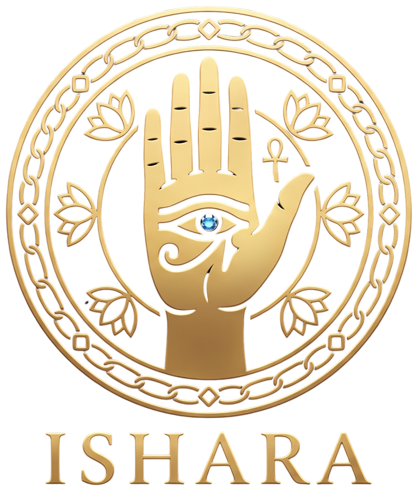

<div align="center">



# إشارة (Ishara)

**A visual reference for Egyptian Sign Language (ESL)**

[](https://ishara-xi.vercel.app/)


</div>

---

## Why this exists

Egyptian Sign Language has documentation, but almost all of it lives in books, PDFs, and academic papers with no visuals. You can read a sentence describing how to sign a letter or a word, but you can't see the hand shape it's describing.

Ishara takes that written documentation, alphabet rules, numbers, vocabulary, grammar structure, and Deaf-culture etiquette, and turns it into something you can actually look at: a hand image for every sign, organized into a searchable, browsable reference. Every entry ties back to the source material it was drawn from, so the content stays traceable to real research instead of inventing signs.

## What's in it

| Section | Contents |
|---|---|
| ✋ Alphabet | 31 letters, with the hand shape, orientation, and phonological rule behind each one |
| 🔢 Numbers | Units, tens, hundreds, and thousands, each with its own hand-orientation rule |
| 💬 Vocabulary | 87 words across 16 categories (daily words, greetings, family, food, home, school, emotions, animals, time, colors, health, clothes, expressions), each with a phonological description and a difficulty level |
| 🧩 Grammar | Sentence structure (Time → Subject → Object → Verb), with spoken-Arabic vs. ESL example pairs |
| 🤝 Deaf culture | Etiquette notes, such as how to get someone's attention respectfully, sourced from documented community norms |

## How it's built

Static site, no framework, no build step.

Plain HTML/CSS/JS with ES modules, one page per section (`index.html`, `dictionary.html`, `grammar.html`, `culture.html`). All content lives in a single `data/content.json`, loaded at runtime by `js/services/content.js`. Each page has its own module under `js/pages/`, dynamically imported based on the page's `data-page` attribute. Dictionary search and category filters run entirely client-side over the JSON, with no backend involved. The site supports dark mode and a full RTL Arabic layout.

### The images

The hand illustrations aren't stock photos. They're composited from real hand-photo bases, with the pose and any motion arrows added according to the phonological description in the data. `scripts/` holds the generation pipeline (Pillow-based compositing, plus some SVG-based hand-drawing experiments) used to produce and iterate on the sign images in `assets/signs/`.

## Project structure

```
├── index.html / dictionary.html / grammar.html / culture.html
├── css/                  # base, layout, components, utilities
├── js/
│   ├── main.js           # entrypoint, loads the right page module
│   ├── pages/            # one module per page
│   ├── components/       # nav, modal, theme toggle
│   └── services/         # content.js, reads data/content.json
├── data/content.json     # every letter, number, word, grammar rule, culture note
├── assets/signs/         # generated hand images (132 files)
├── scripts/              # image-generation pipeline
└── tests/                # data integrity, GUI, media, theme, link, and publish-readiness checks
```

## Running it locally

No dependencies to install, since it's static HTML/CSS/JS.

```bash
git clone https://github.com/Zeyad-101/Ishara.git
cd Ishara
npm start        # serves the site at http://localhost:8080
```

## Tests

```bash
npm test              # full suite
npm run test:data     # validates content.json structure
npm run test:gui      # checks pages render expected elements
npm run test:media    # confirms every referenced image actually exists
npm run test:theme    # dark mode toggle
```

## Deployment

Deployed on Vercel as a static site. `robots.txt` and `sitemap.xml` are already set up for indexing.

## License

MIT
